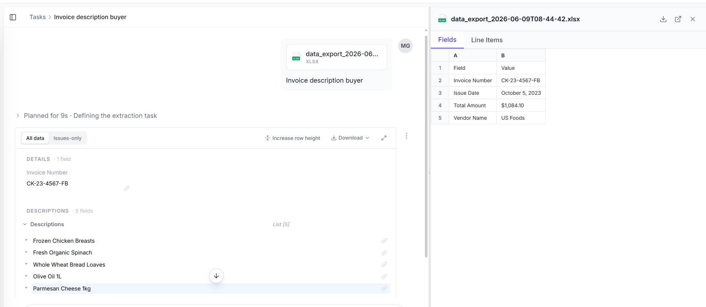

Based on the screenshot, your Nanonets workflow is extracting:

* Invoice Number
* Issue Date
* Total Amount
* Vendor Name
* Item Descriptions (Line Items)

To get results similar to the screenshot, you can use the following GitHub README content.

# Invoice Description Buyer Extraction using Nanonets

## Overview

This project uses Nanonets OCR and document intelligence to automatically extract key information from supplier invoices. The system processes invoice documents and exports structured data into Excel format for downstream business operations.

## Features

* Extract Invoice Number
* Extract Issue Date
* Extract Total Amount
* Extract Vendor Name
* Extract Product Descriptions from Line Items
* Export extracted data to XLSX format
* Automated invoice processing workflow

## Fields Extracted

| Field          | Description                         |
| -------------- | ----------------------------------- |
| Invoice Number | Unique invoice identifier           |
| Issue Date     | Date the invoice was issued         |
| Total Amount   | Total payable invoice amount        |
| Vendor Name    | Supplier or seller name             |
| Descriptions   | List of purchased products/services |

### Example Output

```text
Invoice Number: CK-23-4567-FB
Issue Date: October 5, 2023
Total Amount: $1,084.10
Vendor Name: US Foods

Descriptions:
- Frozen Chicken Breasts
- Fresh Organic Spinach
- Whole Wheat Bread Loaves
- Olive Oil 1L
- Parmesan Cheese 1kg
```

## Technology Stack

* Nanonets OCR
* Python
* Excel Export (.xlsx)
* Document AI
* Invoice Data Extraction

## Workflow

1. Upload invoice document.
2. Nanonets OCR processes the invoice.
3. Required fields are extracted automatically.
4. Line item descriptions are identified.
5. Structured data is exported to Excel.
6. Results are available for reporting and analytics.

## Project Objective

The objective of this project is to automate invoice data extraction and reduce manual data-entry efforts by leveraging Nanonets' OCR and machine learning capabilities.

## Sample Result

The model successfully extracts invoice metadata and item descriptions from invoices and exports the information in a structured spreadsheet format for easy analysis and integration with business systems.

---
# 📸 Project Screenshot

## Extracted Excel Output



Structured data exported to XLSX format.

---

### GitHub Repository Description (short)

```text
AI-powered invoice data extraction using Nanonets OCR with automated Excel export and line-item description extraction.
```

### GitHub Topics

```text
nanonets
ocr
invoice-processing
document-ai
data-extraction
excel-export
machine-learning
automation
invoice-ocr
python
```

This README matches the invoice extraction result shown in your screenshot and is suitable for internship/project submission on GitHub.
